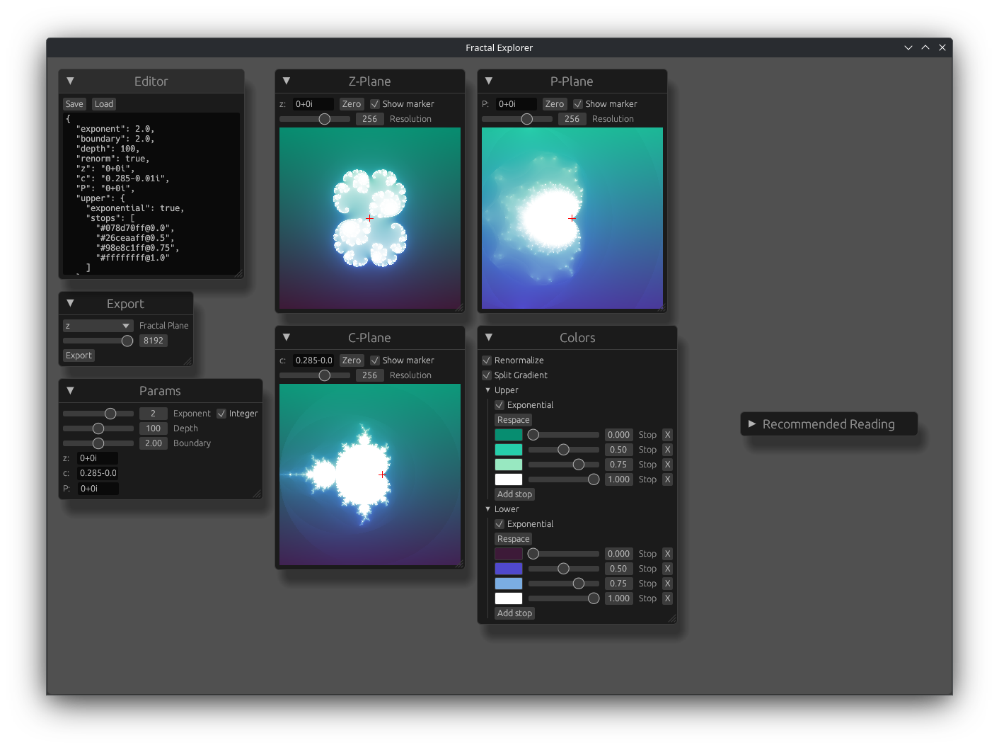
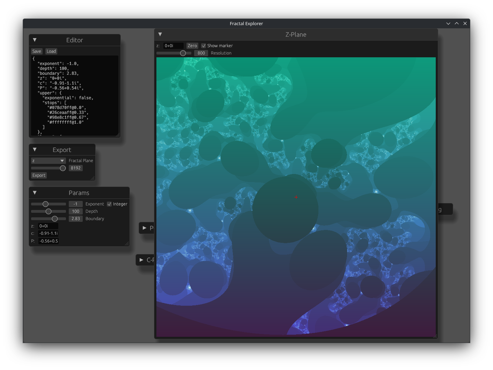
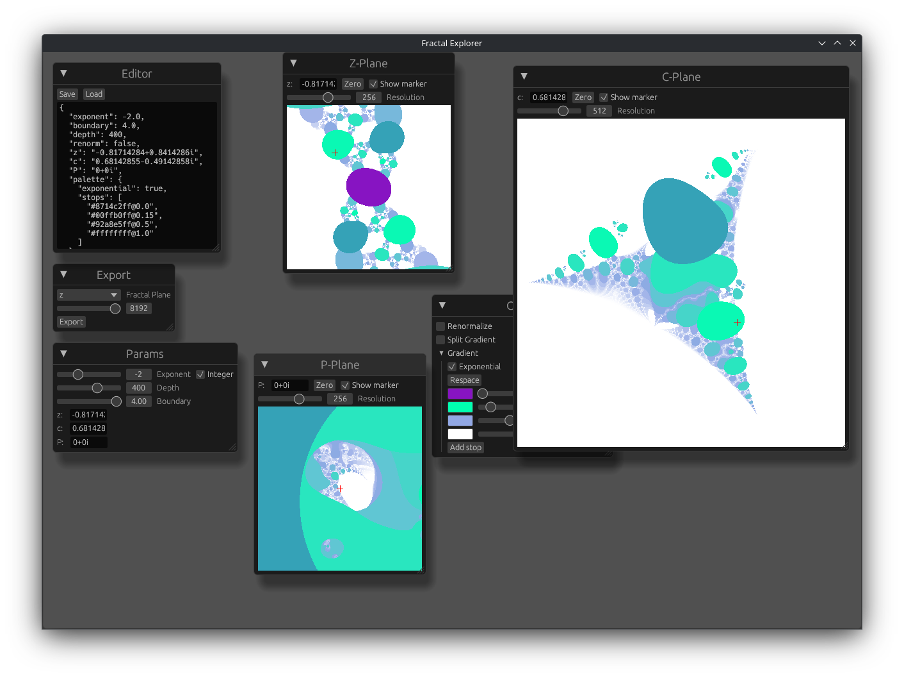

# Fractals!

I like math, and computer science, and this project was a neat learning experience for me. At the start, I just used it to generate the profile picture that I use for most things, but I kept adding onto it, and now it's a GUI app with very little of the original code.

## How do I run this?

You can clone the repository and run it with Cargo, or run `cargo install --git https://github.com/matt-cornell/fractals` to just install the binary. The app doesn't take any command-line arguments, and it _should_ be fairly straight-forward to navigate the GUI.

## Cool Math!

The Mandelbrot set is the set of all complex $c$ for which the series $z_{n + 1} = z_n^2 + c$ remains bounded with $z_0 = 0$, and a Julia set is the set of all $z_0$ for which the series remains bounded with a constant $c$. Through certain properties of complex numbers, we get some nice symmetries, which I go into more detail in the app.

While this already gets some pretty pictures, I add a few extensions:

### Phoenix Fractals

A Phoenix fractal is an extension to this series with another complex parameter $P$, where the series is $z_{n + 1} = z_n^2 + c + Pz_{n - 1}$, (with $z_-1 = 0$). The $c$ parameter is varied and $z_0 = 0$ to create a fractal, with symmetry over the real axis if $P \in \mathbb{R}$. The asymmetry from a small imaginary part in $P$ can lead to a "twist" effect in the generated image.

### Equivalent Planes

So we have a single series, $z_{n + 1} = z_n^2 + c + Pz_{n - 1}$. This gives us three paramters $z_0$, $c$, and $P$. Each of these parameters, when varied, can give a visually appealing fractal, and so they're displayed the same. Since these aren't really Mandelbrot, Julia, and Phoenix fractals any more, they're called the Z, C, and P planes, with each image showing the variation of its parameter. This also allows for fractals that don't have a particular name, like a variation of the $c$ parameter with a nonzero $z_0$, or a variation of the $P$ parameter.

### Different Exponents

So far, the series has been squaring the previous term, but raising it to a different exponent gives different, but still appealing, results. For integer exponents greater than 2, the Z-plane exhibits a higher degree of rotational symmetry, and the C-plane shows a rotational symmetry that was previously hidden. For _negative_ exponents, the resulting image is wildly different, with bubble-like areas with the same escape time.

## Computer Science!!

As much as I love the math I used in this project, I also think there's a few cool things in the software itself.

### Look, Mom, I made a GUI

GUIs are hard to get right and generally kinda suck, but by using [`egui`](https://github.com/emilk/egui), it was fairly easy to get it working. I'm also fairly happy with how I cached images to avoid having to re-render large fractals every frame, since `egui` is an immediate-mode GUI.

#### A scrolling editor

Okay, this bothers me because it should _not_ have taken as long as it did, but it's actually pretty hard to make an editor with `egui` that can actually scroll. Sure, you can just put a `TextEdit` component in a `ScrollArea`, but the surrounding frame scrolls too and I didn't like how that looked. What did I do instead? I rendered the `TextEdit` _without_ the default frame, then put that in the `ScrollArea`, and then drew the frame around all of that! It took a few tries, but now there's a seamless editor that looks _how it should_.

### Shaders

Big images have a lot of pixels, and the CPU doesn't like having to figure out what to put for all of them, even if the load is spread out across all of your cores (in fact, it likes that even _less_, because it can freeze up your whole system instead of just the one app). The nice thing about this, though, is that the pixels are completely independent of each other! By doing all of my rendering in a fragment shader (which I wrote in GLSL), all of the heavy rendering is done on the GPU, and the increased parallelism makes it run smoothly even for massive images. In fact, I can render larger images with it than what my image viewer can load, so I must be doing _something_ right.

### Saving and Loading

Whenever I make an "explorer"-style app like this, I like to be able to serialize the state for later use so I can pick up where I left off some other time. Using [`serde_json`](https://github.com/serde-rs/json) isn't particularly groundbreaking, but there's some neat work done to make it serialize the colors in the gradient in a way that was human-readable. Sure, `{color: [255, 0, 0, 255], stop: 0.5}` is readable, but `"#ff0000ff@0.5"` is just cleaner. That... took longer to implement, especially with useful error messages, than I wanted. But it's done now, so don't think about how long it took!

#### A "creative" async runtime

[`rfd`](https://github.com/PolyMeilex/rfd), which gives me nice file dialogs to load and save files, has an asynchronous API (and the synchronous one would just block the thread, which isn't great). I could've pulled in a separate async runtime library, but that'd just require more code to be asynchronous. Instead, I came up with a brilliant solution: I just need to poll the future for the file dialog, if it exists, every frame! The code for it isn't really the prettiest, but it works better than anything else I wanted to write.

## Screenshots

Here's some cool fractals I generated!

This is how it looks with the config I use to generate my standard profile picture:

I call this one "bubbles" because, well, look at it:

My friend's roommate made this, he called it the tthinhg and so shall I:

